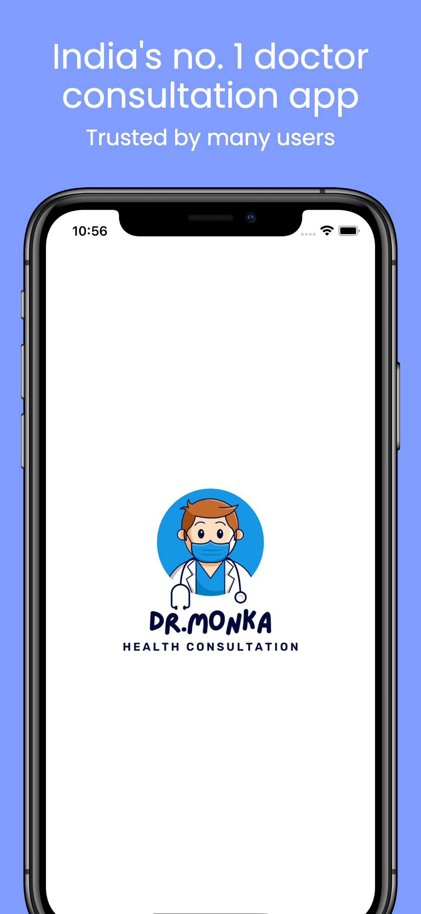
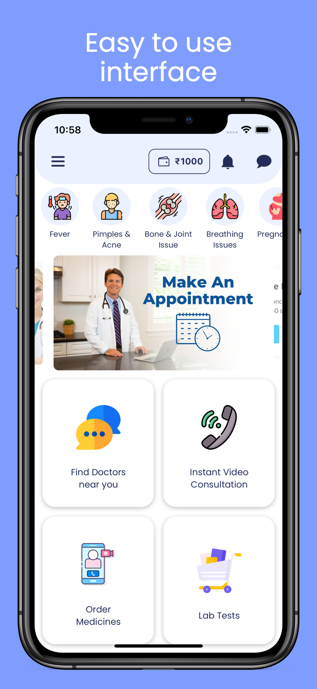
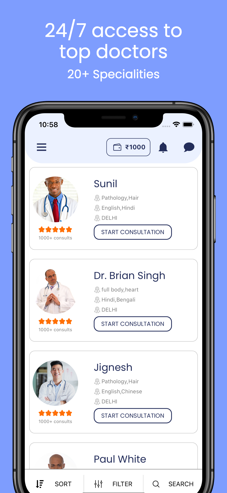
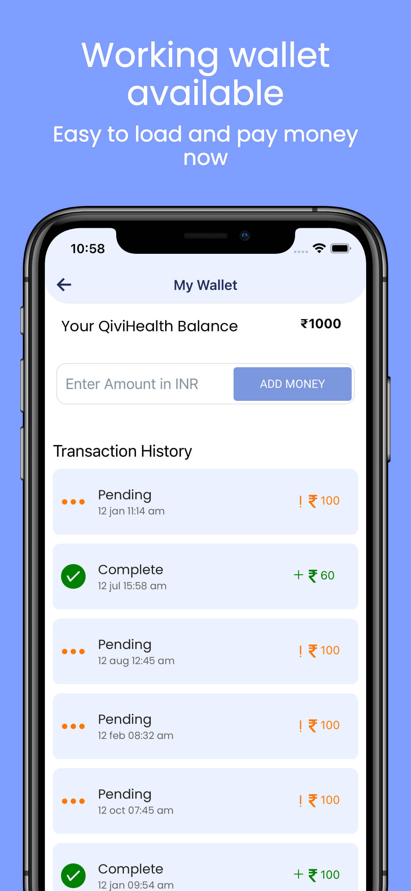
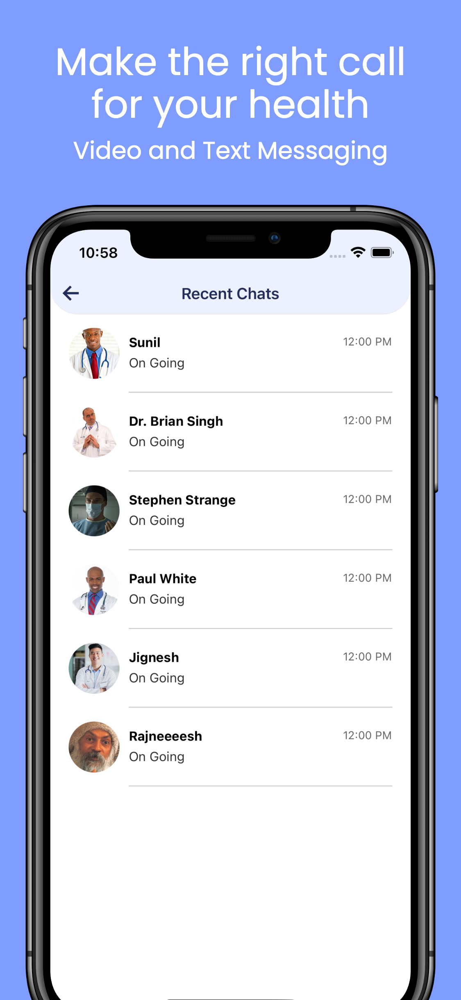
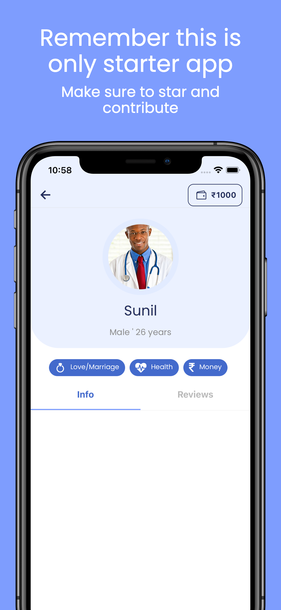

<h1 align="center">
  <a href="https://github.com/DevMonkas/DrMonka">
    
  </a>
  
</h1>

<div align="center">
  Health Consultation Project App
  <br />
  <br />
  <a href="https://github.com/DevMonkas/DrMonka/issues/new?assignees=&labels=bug&template=01_BUG_REPORT.md&title=bug%3A+">Report a Bug</a>
  ·
  <a href="https://github.com/DevMonkas/DrMonka/issues/new?assignees=&labels=enhancement&template=02_FEATURE_REQUEST.md&title=feat%3A+">Request a Feature</a>
  .
  <a href="https://github.com/DevMonkas/DrMonka/discussions">Ask a Question</a>
</div>

<div align="center">
<br />

[](https://github.com/DevMonkas/DrMonka/issues?q=is%3Aissue+is%3Aopen+label%3A%22help+wanted%22)
[](https://github.com/arnabuchiha)
[](https://github.com/flyingninja97)
</div>


---

## About

<table>
<tr>
<td>

Dr.Monka is a mobile app which promotes teleconsulting . The app includes features like -

- User Profile Creation -
  A patient enters their name, address, sex, age, medical history and other vital data needed to start the treatment process to build a profile.

- Book an appointment -
  A user can see a list of doctors, view their profiles, and book an appointment that lasts for 24hrs.

- Video conferencing -
  Patients use this feature when they need a doctor to examine them. Doctors conduct initial observations through video chat, which is why the quality of video is so critical. Proper diagnosis and therapeutic accuracy rely on good connection and clear picture.

- Voice-only calls -
  Most people don’t want to reveal their faces when it comes to psychological issues, and like to speak private. The App provides a voice-only call feature for these purposes. It offers a safe forum for people who feel reluctant to get trained assistance to speak about their issues.

- Built-in chat -
  A patient can use the secure built-in chat to contact a doctor with any urgent query, to get a second consultation, or if they have any questions concerning prescribed medications.

- Payment gateway -
  After the consultation, a patients pays the doctor for the service provided. To achieve this, we have integrated Razorpay payment gateway via API which can accept all major credit/debit cards and even UPI payments.

- Push notifications (WIP) -
  Push notifications are your primary way of communicating with your users. Alert users of upcoming appointments or meetings, alert success transactions and incoming messages and advertise your services.

- Ratings and reviews (WIP) -
  Once the patient has received medical treatment from a doctor a patient can rate the doctor and leave a review. This feature helps new patients make better decisions while finding doctors.

</td>
</tr>
</table>

## Technologies Used

- ### Firebase

  - #### For phone authentication and authorization.

- ### RazorPay

  - #### Integrated payment gateway via RazorPay API which accepts all major credit/debit cards .

- ### ReactNative WebRTC

  - #### For implementing Video/Voice calls.

- ### SocketIO

  - #### For implementing the chat functionality.

- ### MongoDB
  - #### For storing all the users and doctor profile .

## Getting Started

### Prerequisites

- Setup ReactNative CLI development Environment on your machine. Please refer to [ReactNative Docs](https://reactnative.dev/docs/environment-setup).

- Clone this repo on your machine

- Set up the required environment Variables

- Install all the required dependencies using

  ```sh
  npm install
  ```

- Inorder to access all the features of this app like Phone Authentication, Payments, VideoCall you need to configure the backend repo similarly . please refer to [Dr.Monka backend Repo](https://github.com/DevMonkas/MedApp-Backend).

### Running the App

#### IOS

- Run the following command to run the app on your IOS simulator.

  ```sh
  npx react-native run-ios
  ```

- For Macbook M1 related issues Refer to this [link](https://github.com/aiba/react-native-m1) .

#### Android

- Run the following command to run the app on your Android Phone / Simulator.
  ```sh
  npx react-native run-android
  ```

## Screenshots

<p align="center">










</p>

## Demo and repo links

- [DrMonka Doctor App](https://github.com/DevMonkas/MedApp-Doctor)
- [DrMonka Backend](https://github.com/DevMonkas/MedApp-Backend)
- [Demo Video](https://www.youtube.com/watch?v=e77XG_lYW7Y)

## Getting Started

### Prerequisites

- Setup ReactNative CLI development Environment on your machine. Please refer to [ReactNative Docs](https://reactnative.dev/docs/environment-setup).

- Clone this repo on your machine

- Set up the required environment Variables

- Configure the backend repo similarly . please refer to [Dr.Monka backend Repo](https://github.com/DevMonkas/MedApp-Backend).

## Roadmap

See the [open issues](https://github.com/DevMonkas/DrMonka/issues) for a list of proposed features (and known issues).

- [Top Feature Requests](https://github.com/DevMonkas/DrMonka/issues?q=label%3Aenhancement+is%3Aopen+sort%3Areactions-%2B1-desc) (Add your votes using the 👍 reaction)
- [Top Bugs](https://github.com/DevMonkas/DrMonka/issues?q=is%3Aissue+is%3Aopen+label%3Abug+sort%3Areactions-%2B1-desc) (Add your votes using the 👍 reaction)
- [Newest Bugs](https://github.com/DevMonkas/DrMonka/issues?q=is%3Aopen+is%3Aissue+label%3Abug)

## Improvements for Future

- Doctors Filters based on GeoLocation is required .
- Doctor Profile implementation including ratings and reviews .
- Video Call feature improvements. (Rejoin call if connection issue, proper throttling whenever needed etc.)
- React Native CallKit integration .
- Push Notifications implementation.

## Contributing

First off, thanks for taking the time to contribute! Contributions are what makes the open-source community such an amazing place to learn, inspire, and create. Any contributions you make will benefit everybody else and are **greatly appreciated**.

Please try to create bug reports that are:

- _Reproducible._ Include steps to reproduce the problem.
- _Specific._ Include as much detail as possible: which version, what environment, etc.
- _Unique._ Do not duplicate existing opened issues.
- _Scoped to a Single Bug._ One bug per report.

## Support

Reach out to the maintainer at one of the following places:

- [GitHub discussions](https://github.com/DevMonkas/DrMonka/discussions)
- The email which is located [in GitHub profile](https://github.com/arnabuchiha)

## License

This project is licensed under the **MIT license**. Feel free to edit and distribute this template as you like.

See [LICENSE](LICENSE) for more information.

##

<p  align="center">
Show some love ❤️ and Star ⭐️ the Repository to support the project.
</p>
